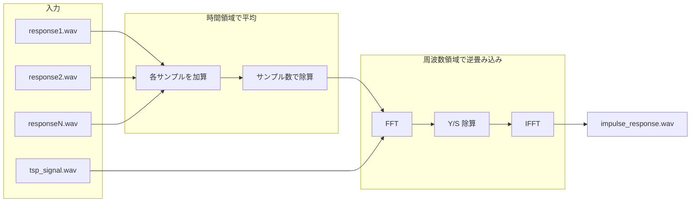

# 複数TSP応答の平均化とIR算出

## 現状

- [tsp_to_ir.c](tsp_to_ir.c) は1つのTSP応答ファイルのみ対応
- 周波数領域での処理（FFT → 除算 → IFFT）は既に実装済み

## 処理フロー




## 変更内容

### 1. コマンドライン引数の変更

**現在:**

```
./tsp_to_ir tsp_signal.wav tsp_response.wav impulse_response.wav
```

**変更後:**

```
./tsp_to_ir tsp_signal.wav response1.wav response2.wav ... impulse_response.wav
```

- 引数2〜最終-1: 応答ファイル（1個以上）
- 最終引数: 出力IRファイル

### 2. main の修正（[tsp_to_ir.c](tsp_to_ir.c) 173行目付近）

- `argc >= 4` で応答ファイルが1つ以上あることを確認
- 応答ファイル数を `argc - 3` として取得

### 3. 平均化ロジックの追加

- 各応答WAVを `read_wav` で読み込み
- 長さが異なる場合は最短の長さに揃える（または最長にゼロパディング）
- `double` 配列に加算してから `count` で除算して平均を算出
- 既存の `response_samples` 相当のバッファに代入して以降の処理へ

### 4. 既存処理の利用

- 周波数領域での逆畳み込み（250–261行付近）はそのまま使用
- 時間領域での畳み込みは行わない（現状どおり周波数領域の除算のみ）

## 実装の注意点

- サンプル数が異なる応答の場合: 最短長に切り詰めるか、最長長でゼロパディングするか方針を決める（推奨: 最短に揃える）
- 1ファイルのみ指定した場合は平均 = その1ファイルとなり、従来と同じ動作になる
- 使用例: `./tsp_to_ir tsp_signal.wav rec1.wav rec2.wav rec3.wav impulse_response.wav`

